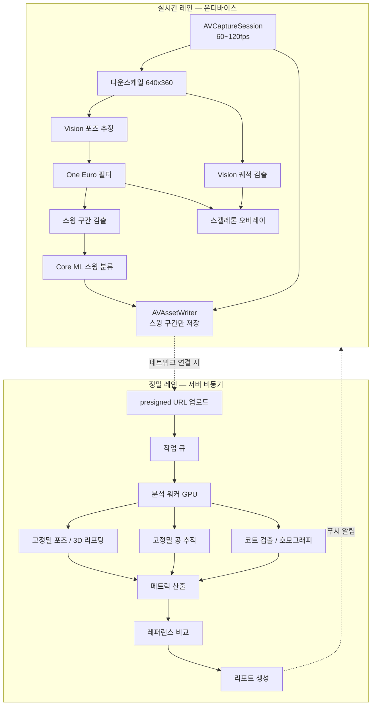
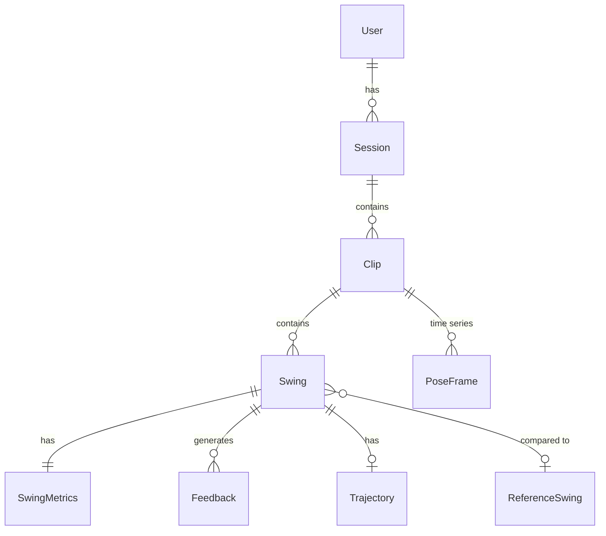

# 02. 시스템 아키텍처

## 2.1 핵심 결정: 온디바이스 / 서버 하이브리드

✅ **확정** — [ADR-0001](../05-결정/adr/ADR-0001-hybrid-inference.md)

실시간 처리는 전부 기기에서, 정밀 분석은 서버에서 비동기로 수행합니다.



### 왜 이렇게 나누는가

**실시간을 서버로 보내지 않는 이유**
- 테니스 코트는 네트워크 환경이 나쁘다 (야외, 지하, 실내 코트 공용 와이파이)
- 1080p 60fps 스트리밍은 데이터 비용과 지연을 모두 감당할 수 없다
- 촬영 중 오버레이는 100ms만 늦어도 쓸모없다

**전부 온디바이스로 하지 않는 이유**
- 모델을 개선해도 앱 심사를 거쳐야 배포된다 (개선 루프가 주 단위로 늘어짐)
- 프로 레퍼런스 라이브러리를 전부 기기에 넣을 수 없다
- 기기 간 데이터 동기화, 장기 진척도 추적이 불가능하다
- 무거운 모델(3D 리프팅, TrackNet 계열)은 실시간 예산에 들어가지 않는다

### 오프라인 우선 원칙

네트워크가 없어도 **UC-1(촬영)과 UC-2(리플레이)는 완전히 동작해야 합니다.** 서버는 부가 가치를 더할 뿐 필수 경로가 아닙니다. 이 원칙은 Phase 0에서 백엔드 없이 시작하는 근거이기도 합니다.

## 2.2 계층 구조

```
┌──────────────────────────────────────────────┐
│ Presentation   SwiftUI Views / ViewModels    │
├──────────────────────────────────────────────┤
│ Domain         Entities / UseCases           │  ← 순수 Swift, 의존성 0
│                Repository Protocols          │
├──────────────────────────────────────────────┤
│ Data           Network / Persistence         │
│                Repository Implementations    │
├──────────────────────────────────────────────┤
│ VisionKit      Pose / Ball / Court / Swing   │  ← UIKit 의존 없음
│                Metrics                       │     영상 입력 → 분석 결과 출력
└──────────────────────────────────────────────┘
```

**VisionKit을 별도 계층으로 분리하는 이유**가 중요합니다. UI에 의존하지 않으면 고정된 샘플 영상을 입력으로 넣어 **결정론적 회귀 테스트**를 돌릴 수 있습니다. 이 앱에서 가장 가치 있는 테스트가 바로 그것입니다 — "이 영상에서 스윙 12개가 검출되고 평균 팔꿈치 각도가 148°여야 한다"를 CI에서 검증할 수 있습니다.

## 2.3 데이터 흐름

### 촬영 시
```
CMSampleBuffer (1080p60)
  ├─→ AVCaptureVideoPreviewLayer          (즉시 표시)
  ├─→ 다운스케일 640x360 → 분석 파이프라인 (비동기)
  │     ├─ 포즈 → 필터 → 스켈레톤 오버레이
  │     ├─ 포즈 시퀀스 → 스윙 검출 → 분류
  │     └─ 궤적 검출 → 궤적 오버레이
  └─→ 링 버퍼 (최근 5초 보관)
        └─ 스윙 감지 시 [t-2s, t+2s] 구간을 AVAssetWriter로 기록
```

**링 버퍼가 필요한 이유**: 스윙은 끝난 뒤에야 검출됩니다. 시작 시점을 소급해 저장하려면 과거 프레임을 들고 있어야 합니다.

### 업로드 및 서버 분석
```
1. 앱: POST /clips           → clipId + presigned upload URL 수신
2. 앱: PUT  <presigned URL>  → 오브젝트 스토리지에 직접 업로드 (API 서버 경유 X)
3. 앱: POST /clips/{id}/complete
4. 서버: 큐에 분석 작업 등록 → 202 Accepted
5. 워커: 다운로드 → 분석 → 결과 저장 → 푸시 알림
6. 앱: GET /clips/{id}/analysis
```

업로드는 **Wi-Fi 연결 시에만, 백그라운드 전송으로** 수행합니다. `URLSession` background configuration을 사용합니다.

## 2.4 도메인 모델



| 엔티티 | 핵심 필드 |
|---|---|
| **User** | id, appleUserId, nickname, dominantHand, skillLevel, createdAt |
| **Session** | id, userId, startedAt, endedAt, location?, swingCount, avgScore |
| **Clip** | id, sessionId, localURL, remoteKey?, duration, fps, resolution, uploadState, analysisState |
| **Swing** | id, clipId, startTime, endTime, type(forehand/backhand/serve/volley), phases[], score, confidence |
| **SwingMetrics** | swingId, kneeFlexion, hipShoulderSeparation, elbowAngleAtImpact, contactPointHeight, contactPointDepth, followThroughAngle, shoulderTilt, headStability, ... |
| **PoseFrame** | timestamp, joints[19] {x, y, confidence}, (3D일 경우 z) |
| **Trajectory** | swingId, points[{t, x, y}], courtPoints[{t, X, Y}]?, bounce?, speedKmh?, inOut? |
| **Feedback** | swingId, severity, jointName, message, metricValue, recommendedRange |
| **ReferenceSwing** | id, playerName, type, poseSequence, metrics, videoURL |

### 저장 전략

`PoseFrame`이 문제입니다. 60fps × 19관절 × 5초 = **5,700개 좌표**가 스윙 하나마다 생깁니다. DB에 행 단위로 넣으면 금방 폭발합니다.

| 데이터 | 저장 위치 | 형식 |
|---|---|---|
| 메타데이터 (User, Session, Clip, Swing, Metrics, Feedback) | 로컬 DB / PostgreSQL | 정규화된 테이블 |
| 포즈 시계열 | 파일 | Protobuf 또는 JSON+gzip, 클립당 1파일 |
| 궤적 시계열 | 메타 DB에 인라인 | 점 개수가 적음 (수십 개) |
| 영상 | 로컬 파일 / 오브젝트 스토리지 | HEVC |

✅ **확정** — 포즈 시계열은 **Protobuf**로 직렬화한다 ([D-09](../05-결정/stack/D-09-serialization.md)). 스키마는 `contracts/proto/`에 두고 Swift·Python 양쪽에서 생성한다.

## 2.5 상태 머신

클립의 생명주기를 명시적으로 관리합니다. 이게 없으면 업로드/분석 실패 시 복구가 불가능해집니다.

```
recording → recorded → [uploadPending → uploading → uploaded]
                                  ↓ 실패
                              uploadFailed (재시도)

uploaded → analysisQueued → analyzing → analyzed
                                  ↓ 실패
                              analysisFailed (재시도 / 원인 보고)
```

로컬 분석 결과는 서버 분석과 **독립적으로** 유지됩니다. 서버 분석이 완료되면 더 정확한 값으로 갱신하되, 로컬 결과를 지우지 않습니다 (오프라인에서 계속 보여야 하므로).

## 2.6 프라이버시 원칙

얼굴이 담긴 영상을 다루므로 설계 단계에서 못박습니다.

- **온디바이스 우선**: 서버 업로드 없이도 핵심 기능이 동작한다
- **명시적 옵트인**: 업로드는 사용자가 켜야 시작된다. 기본값은 꺼짐
- **최소 수집**: 스윙 구간만 업로드하고 세션 전체 영상은 보내지 않는다
- **삭제 권한**: 사용자가 클립을 지우면 서버 원본과 파생 데이터도 삭제한다
- **ATT / 개인정보 처리방침**: 심사 통과에 필수. Phase 2 이전에 준비

## 관련 문서

- [제품 개요](../01-제품/PRODUCT-OVERVIEW.md)
- [비전 파이프라인](../02-설계/VISION-PIPELINE.md)
- [iOS 기술 스택](../03-기술스택/IOS-STACK.md)
- [백엔드 기술 스택](../03-기술스택/BACKEND-STACK.md)
- [ADR-0001 하이브리드 추론](../05-결정/adr/ADR-0001-hybrid-inference.md)

---

[← 문서 허브](../INDEX.md)
